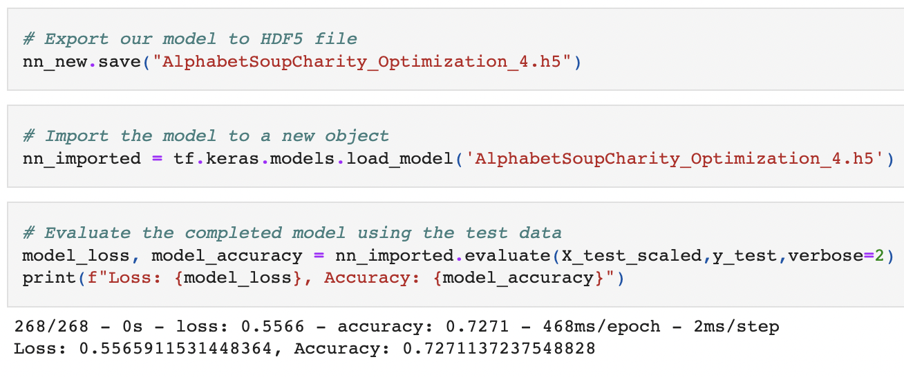

# Neural_Network_Charity_Analysis

## Overview of the Project

The goal of this project is to build a machine learning algorithm that can use data to identify if Alphabet Soup's funding for charity are being used effectively or not. 

Using several attributes of companies with previous funding and its success rate, this project will use this data to analyze and predict possible success rate for applicants.

## Resources
- Data Source: charity_status.csv
- Software: Python, Scikit, jupyter notebook
---

## Results

The data was pre processed. Using Neural Network, using the preprocessed data a model was trained and built. Using the test dataset the accuracy was determined and the model was saved into a file.

Additional details on the results:
 - Data Preprocessing
    - IS_SUCCESSFUL column was considered as target column for the model as it contained a boolean value (1 or 0) for its success response.
    - APPLICATION_TYPE, AFFILIATION, CLASSIFICATION, USE_CASE, ORGANIZATION, STATUS, SPECIAL_CONSIDERATIONS, ASK_AMT were the features for the initial model
    - EIN and NAME were removed as they were unique for an application and would not add value and possibly overfit it would in the dataset
 - Compiling, Training and Model Evaluation
    - Using 110 neurons in 2 layers to explore all the dimensions possible with the giving inputs. Used relu activation function as it can range from 0 to infinity. At the end sigmoid was used to classify successful or not.
    - For model accuracy could see at 72.57%. Though its helpful, need to explore options on making it more efficient over 80%.
    - To increase the performance of the model, several options were tested
        1. Removed attributes - INCOME_AMT and one of SPECIAL_CONSIDERATION. This was tested as INCOME_AMT had 9 values in ranges and 0 being the majority of the values. (72.72%)
        2. Change in Neural Network Structure (72.65%)
            - Tried changing Neuron counts (80 / 40 / 20)
            - Tried adding a hidden layers (3)
            - Tried tanh activation function
        3. Changing binning condition to reduce unique values of application type and all in the same scale. (72.59%)
        4. Here changed income amout to integer value by taking starting value of the range. (72.71%)
            

---

## Summary

Using Neural Network with several options could not get accuracy above 80%. As recommendations, first would be explore more options in Neural Networks combining changes to neuron/layer counts along with change in attributes.

Another model that could be recommended would be the randon forest classifier. This would help as it can consider multiple dimensions and the data is in a tabular format. This ensemble learning model is proven to be quick and efficient in these use cases.
